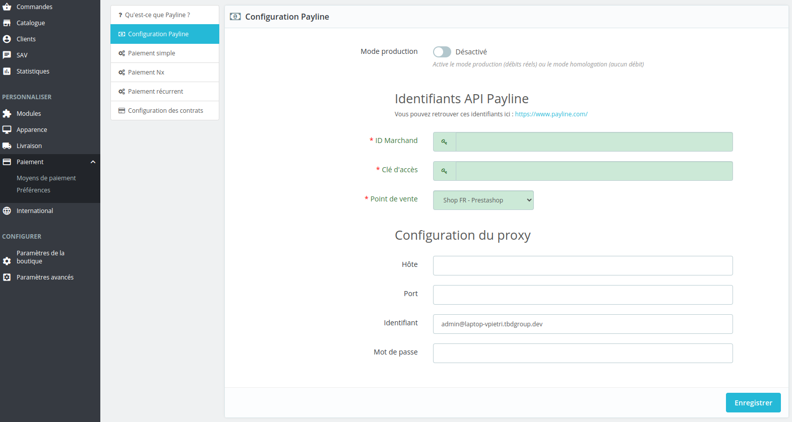
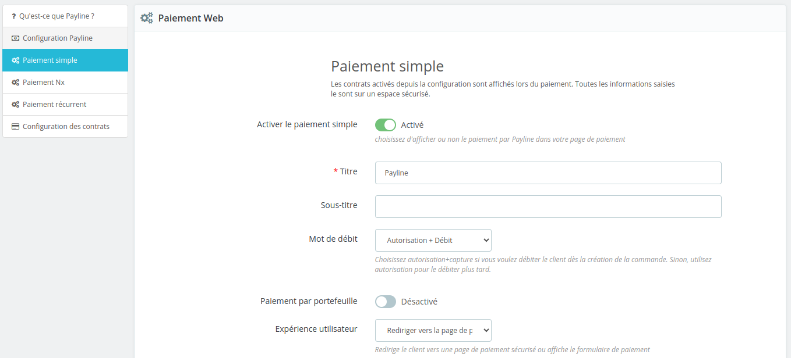
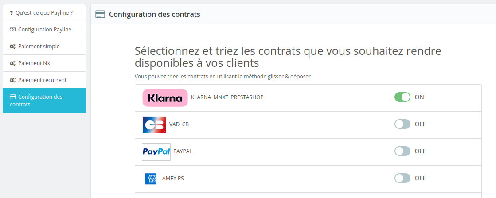

# 

# Monext Prestashop Plugin

----

## Table of Content

* [Overview](#overview)
* [Features](#features)
* [Installation](#installation)
    * [Requirements](#requirements)
    * [Installation process](#installation-process)
* [Configuration](#configuration)
* [Additional resources for developers](#additional-resources-for-developers)
* [License](#license)
* [Contact and support](#contact-and-support)

## Overview

This plugin allows you to use the Monext payment system with a Prestashop ecommerce application.

## Features

This plugin integrate with native Prestashop orders' workflow and provides the following features:
It allows you to:
* Do offsite payment on a payment page hosted by Monext.
* Cancel payments.
* Refund payments.

### Supported payment methods

This plugin supports the several payment methods.
You can also check [our documentation](https://docs.monext.fr/display/DT/Payment+Method) for more information about other supported payment methods.

## Installation

### Requirements

* Prestashop 8 (1.7 may be compatible but no more supported).
* Php 7.3
* This extension has a dependency with  <a href="https://github.com/PaylineByMonext/payline-php-sdk">payline-php-sdk</a>, make sure your environment is compliant

If you already use 1.7.* version of our module, uninstall it (save your access key before that)</li>

### Installation process

See https://addons.prestashop.com/fr/content/21-howto

Manual process
* Download <b>payline-prestashop-master.zip</b> archive from GitHub.</li>
* Unzip it
* Rename the <b>payline-prestashop-master</b> root folder to <b>payline</b>. Save changes.
* Use modified archive to install extension through your Prestashop back office.

## Configuration

Here are the main configuration fields for the payment method:

* Configuration
    * Merchant ID
    * Access key
    * Environment
        * Homologation for debug and test purpose.
        * Production for real payment.
    * Point of sell
  

* Web payment
    * Title
    * Sub-title
    * Payment action
    * UX experience

* Contracts

## Additional resources for developers

To learn more about how the API used by the plugin and how to modify or use Prestashop with it to fit your needs:
* [Prestashop Plugin Monext documentation](https://docs.monext.fr/display/DT/Prestashop+8.x+plugin)
* [Monext API documentation](https://api-docs.retail.monext.com/reference/getting-started-with-your-api)
* [Prestashop developer documentation](https://devdocs.prestashop-project.org/)

## License

This plugin's source code is completely free and released under the terms of the MIT license.

## Contact and support

If you want to contact us, the best way is through [this page on our website](https://www.monext.fr/gardons-le-contact) and send us your question(s).

We guarantee that we answer as soon as we can!

If you need support you can also directly check our FAQ section and contact us [on the support page](https://support.payline.com/hc/fr).
